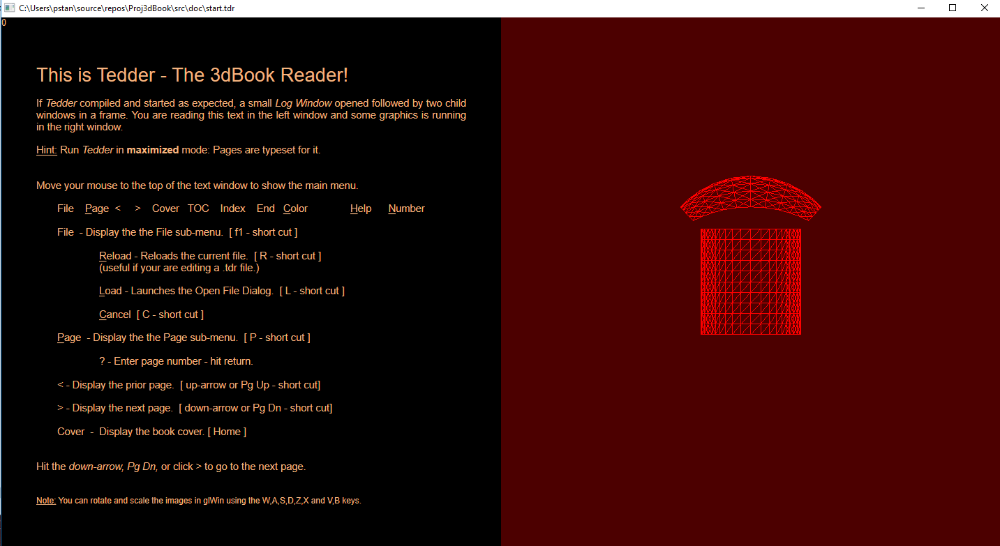

# Proj3dBook
# 3dBook-Reader v.0.0   

### 5 - 14 - 2019   Update commit to this github repository from my local repository.

## The Program. 
If you are able to get this source code to compile and run; your machine's display should resemble the screen shot above.

You see a Windows desktop parent window containing two child windows. The window on the left is the Direct Write - Direct 2D window (DW window), the window on the right is the OpenGL window (GL window).  

## The Concept:  
A prototype for a book format reader combining high quality text typesetting and realtime 3d graphics interactively.

## The 3dBook-Reader Files: 
This project is called *"The 3dBook-Reader"* ; so what does the reader read?

The **3dBook-Reader**  parses a formatted Wnicode text file with the .tdr file extension.  The format is similar to that of an .rtf file but simpler.  The human readability and write-ability is on par with that of a markdown language file like this README.md.  The typesetting capabilities are similar; with sizes, bolds, italics, strike-throughs, underlines and such. Since the typesetting is implemented with the Dwrite API all its methods are available for future development.

The project is called *"The 3dBook-Reader"* , not the *"The 3dScroll-Reader"* ; so it is a **book**  and is paginated like a book.

On start up, the reader loads a file, *start.tdr*, which presents some information about the user interface:  Menus, how to page thru the book, load a file etc.

In this version the DW window controls what openGL graphics routine is run in the GL window.  The .tdr file tells the DW window which openGL routine goes with which pages.
